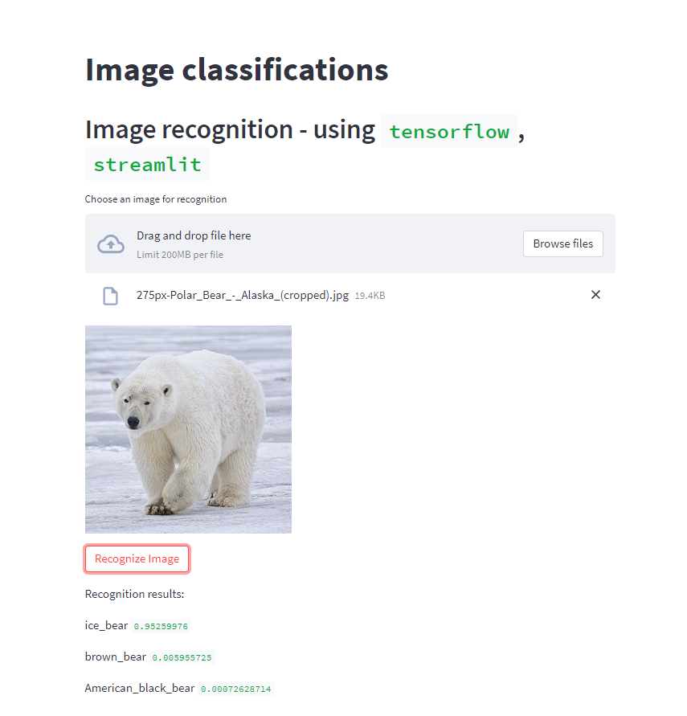

# Image classifications

**Image classifications** This application can recognize the picture and show the results in the form of "what is shown in the picture" and "probability of similarity"

# How to use ?

1. Use the [streamlit application](https://on-tensorflow-imageclassification.streamlit.app/).

2. You need to upload the image you want to recognize

3. Next, you need to wait for the image processing to be performed. After the processing is finished, you can see the results

